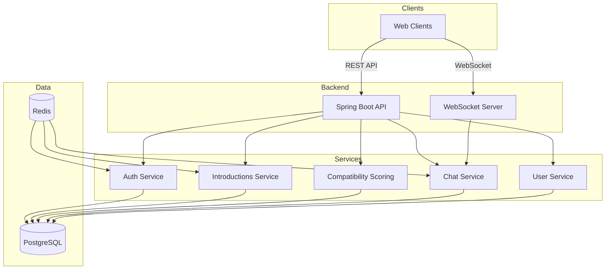

# Chattr

A values-based matchmaking platform built with Spring Boot and Next.js. Supports intentional introductions, compatibility scoring, and real-time messaging. Designed for quality over quantity with anti-swipe matching.

## Architecture

## System Overview

- **Backend Service**: Spring Boot monolith handling REST API requests and WebSocket connections for real-time chat.
- **Auth Service**: Manages user registration, login, JWT authentication, and session management.
- **Introductions Service**: Generates 1-3 daily introductions per user based on compatibility scoring, handles accept/pass logic, and creates matches when both users accept.
- **Compatibility Scoring**: Computes compatibility scores from questionnaire answers using weighted similarity matching.
- **Chat Service**: Handles 1:1 messaging with WebSocket support for real-time delivery, typing indicators, and read receipts.
- **User Service**: Manages user profiles, preferences, blocking, reporting, and account settings.
- **Database**: PostgreSQL stores all persistent data including users, questionnaire answers, introductions, matches, and messages.
- **Cache**: Redis is used for rate limiting, presence tracking, and session management.

## Features

- Values-based matching using questionnaire compatibility scoring.
- Daily introductions limited to 1-3 per user for intentional matching.
- Real-time messaging with WebSocket support.
- User authentication with JWT tokens.
- Block and report functionality for safety.
- Pause matching and account management.

## Tech Stack

- **Backend:** Java 21, Spring Boot, PostgreSQL, Redis, WebSocket
- **Frontend:** Next.js 15, TypeScript, Tailwind CSS
- **Realtime:** WebSockets (STOMP over SockJS)
- **Auth:** JWT
- **Infra:** Docker, Docker Compose
- **Architecture:** Monolith
