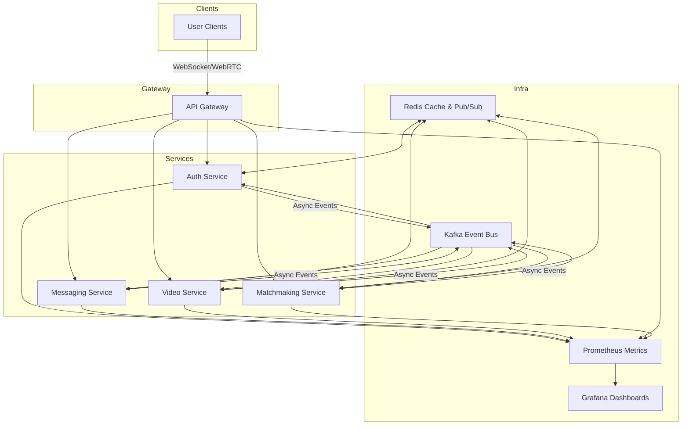

# Chattr

A distributed real-time chat and video platform built with microservices and event-driven architecture. Supports scalable messaging, authentication, and video calls with Kafka, Redis, WebSockets, and WebRTC. Designed for reliability, observability, and horizontal scalability.

## Architecture

## System Overview

- **Gateway Service**: Handles WebSocket connections from clients and routes requests to the appropriate microservices.
- **Auth Service**: Manages user signup, login, authentication tokens, and session management.
- **Messaging Service**: Handles sending and receiving chat messages, persisting them to PostgreSQL.
- **Video Service**: Manages WebRTC signaling and video session orchestration.
- **Matchmaking Service**: Coordinates pairing of users for chat or video sessions, using Redis for state tracking and Kafka for scalable event processing.
- **Event Bus**: Kafka is used for asynchronous event communication between services.
- **Cache/State**: Redis is used for presence tracking, rate limiting, and pub/sub messaging.
- **Observability**: Prometheus collects metrics from services, with Grafana dashboards for visualization and logs aggregation.

## Features

- Real-time text chat with delivery guarantees.
- Video chat with WebRTC integration.
- User authentication and secure session management.
- Horizontal scaling enabled by Kafka and Redis.
- Observability through Prometheus and Grafana.
- Continuous integration and deployment using Docker and Kubernetes.

## Tech Stack

- **Backend:** Java, Spring Boot, Kafka, Redis, PostgreSQL, gRPC
- **Realtime:** WebSockets, WebRTC
- **Infra:** Docker, Kubernetes, Prometheus, Grafana
- **Architecture:** Microservices, Event-driven
